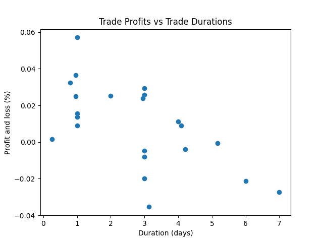

# Some Interesting Things I Implemented
- Utilization of NEAT and ES-HyperNEAT algorithms from other authors
- During training, randomizing the stocks that are used to train the model to increase the amount of data
- Custom/fancy scoring metrics, see `parallelized_algorithmic_trader.performance_analysis.get_curve_fit_vwr`
- Model persistance
- Randomized fitness functions, allowing easy promotion of multiple attributes. Examples: prioritizing returns while also promoting some minimum trading frequency so that model can be validly assesed on some minimum number of trades.

# Demonstration with NEAT
The purpose of this is to show some basic functionaly, especially demonstrating that machine learning algorithm is optimizing for profit. To accomplish this, the experiment is constructed with a small set of data and large set of features so that the algorithm with **over fit** the data. 

## Parameters
### Data
- Tickers: [SPY]
- HOUR candle resolution
- Total time range from March 2022 to March 2023
- Technical analysis indicators as shown
### Training Parameters
- Train on the first 80% of data and test on the last 20%
- NEAT algorithm from `/genetic_algorithm_trading/neat`
- Fitness function: Return on investment
- Population size: 70
- Generations: 40

## Train Data Results




**Output**
```
INFO pat.performance_analysis: General performance metrics:
INFO pat.performance_analysis: Max drawdown: $701, 7.0%
INFO pat.performance_analysis: Starting value: $10000; final value: $12058
INFO pat.performance_analysis: Total return: 20.6%, annualized return 58.6%


INFO pat.performance_analysis: Trade stats:
INFO pat.performance_analysis: # of buys: 22, # sells: 22.
INFO pat.performance_analysis: Mean trade profit: 0.88%, stddev 2.23
INFO pat.performance_analysis: Mean time to exit: 66 hours, stddev 43
INFO pat.performance_analysis: Mean time from buy to buy: 157 hours, 6.52 days
INFO pat.performance_analysis: Win rate: 63.6 %
INFO pat.performance_analysis: VWR: 0.187, VWR curve fit: 0.144
INFO pat.performance_analysis: Alpha relative to ticker SPY 28.50%
```

## Test Data Results


```
INFO pat.performance_analysis: General performance metrics:
INFO pat.performance_analysis: Max drawdown: $125, 1.3%
INFO pat.performance_analysis: Starting value: $10000; final value: $10464
INFO pat.performance_analysis: Total return: 4.6%, annualized return 57.6%


INFO pat.performance_analysis: Trade stats:
INFO pat.performance_analysis: # of buys: 6, # sells: 5.
INFO pat.performance_analysis: Mean trade profit: 0.83%, stddev 0.86
INFO pat.performance_analysis: Mean time to exit: 44 hours, stddev 43
INFO pat.performance_analysis: Mean time from buy to buy: 132 hours, 5.50 days
INFO pat.performance_analysis: Win rate: 60.0 %
INFO pat.performance_analysis: VWR: 0.045, VWR curve fit: 0.042
INFO pat.performance_analysis: Alpha relative to ticker SPY 1.63%
```
## Conclusion
While the results here are on the surface positive, I expect from experience that this model likely would not make money. The data set here is too small for this to be valid. If you look at the testing, you can see that only 5 trades were executed, far too few for this to be a good estimation of the models performance. This is a demonstration only.

I forgot to save the image of the neural net associated with this.
